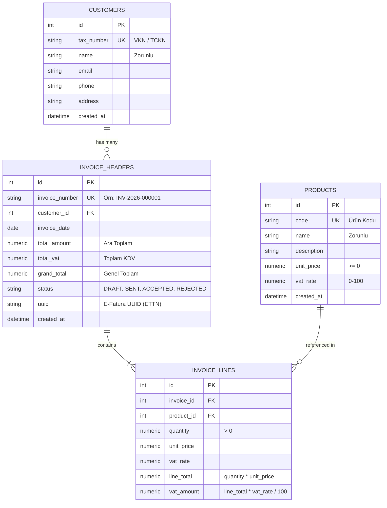

# Mikroservis Tabanlı E-Fatura Entegrasyon ve API Modülü

Bu proje, modern bir ERP sisteminin temel faturalama süreçlerini simüle eden, RESTful API üzerinden **Müşteri (Customer)**, **Ürün (Product)** ve **Fatura (Invoice)** işlemlerini gerçekleştiren ve kurumsal düzeyde **GİB (Gelir İdaresi Başkanlığı) / Özel Entegratör** E-Fatura servisleriyle entegre olabilecek şekilde tasarlanmış profesyonel bir backend uygulamasıdır.

---

## İçindekiler
- [Proje Amacı ve Özellikler](#proje-amacı-ve-özellikler)
- [Kullanılan Teknolojiler](#kullanılan-teknolojiler)
- [Mimari ve Tasarım Prensipleri](#mimari-ve-tasarım-prensipleri)
- [Klasör Yapısı](#klasör-yapısı)
- [Veritabanı Tasarımı ve İlişkiler](#veritabanı-tasarımı-ve-ilişkiler)
- [Kurulum ve Çalıştırma](#kurulum-ve-çalıştırma)
  - [1. Sanal Ortam (Virtualenv) Oluşturma](#1-sanal-ortam-virtualenv-oluşturma)
  - [2. Bağımlılıkların Kurulumu](#2-bağımlılıkların-kurulumu)
  - [3. Çevre Değişkenleri (.env)](#3-çevre-değişkenleri-env)
  - [4. Veritabanı Migrasyonları (Alembic)](#4-veritabanı-migrasyonları-alembic)
  - [5. Örnek Verilerin Yüklenmesi (Seed Data)](#5-örnek-verilerin-yüklenmesi-seed-data)
  - [6. Uygulamanın Başlatılması](#6-uygulamanın-başlatılması)
- [API Dokümantasyonu ve Endpointler](#api-dokümantasyonu-ve-endpointler)
- [Örnek İstek ve Yanıtlar](#örnek-istek-ve-yanıtlar)
- [E-Fatura Entegrasyon Mimarisi ve Gelecek Yol Haritası](#e-fatura-entegrasyon-mimarisi-ve-gelecek-yol-haritası)
- [Testlerin Çalıştırılması](#testlerin-çalıştırılması)

---

## Proje Amacı ve Özellikler

1. **Katmanlı Kurumsal Mimari**: Router, Service, Repository, Model ve Schema katmanlarının tam izolasyonu.
2. **Güvenilir Fatura Hesaplama Mantığı**: Müşteri tarafından gönderilen toplam tutarlar kabul edilmez; birim fiyatlar ve KDV oranları veritabanındaki ürün kayıtlarından alınarak satır ve dip toplamlar arka planda transaction güvencesiyle hesaplanır.
3. **Otomatik ve Sıralı Fatura Numarası Üretimi**: Fatura tarihinin yılına göre çakışmasız ve sıralı numaralandırma (Örn: `INV-2026-000001`).
4. **Normalizasyon ve Veri Bütünlüğü**: En az 3NF kuralına uygun veritabanı tasarımı; Check Constraint'ler, Unique ve Foreign Key kısıtlamaları.
5. **E-Fatura Abstraction Mimarisi**: Mock ve gerçek GİB/Özel Entegratör servislerinin `BaseEInvoiceService` soyutlaması üzerinden tak-çıkar (pluggable) şekilde çalışabilmesi.
6. **Kapsamlı Test Kapsamı**: İzole test veritabanı üzerinde 18 farklı birim ve entegrasyon test senaryosu.

---

## Kullanılan Teknolojiler

* **Python 3.12+** (Python 3.14 ile tam uyumlu)
* **FastAPI**: Yüksek performanslı modern asenkron web framework'ü
* **Uvicorn**: ASGI web sunucusu
* **SQLAlchemy 2.x**: Modern `Mapped` / `mapped_column` sözdizimli ORM
* **Pydantic v2 & Pydantic Settings**: Tip güvenliği, veri doğrulama ve konfigürasyon yönetimi
* **SQLite**: Yerel geliştirme ve test ortamı (PostgreSQL/MySQL uyumlu)
* **Alembic**: Veritabanı şema versiyonlama ve migrasyon aracı
* **python-dotenv**: Ortam değişkenleri yönetimi
* **pytest & HTTPX**: Uçtan uca ve birim testler
* **Swagger UI & ReDoc**: Otomatik interaktif API dokümantasyonu

---

## Mimari ve Tasarım Prensipleri

Uygulama, **Sorumlulukların Ayrılığı (Separation of Concerns)** ve **Temiz Mimari (Clean Architecture)** ilkelerine göre inşa edilmiştir:

* **`Routers`**: HTTP isteklerini karşılar, parametreleri doğrular ve servis katmanına iletir.
* **`Services`**: İş mantığını (business logic), fatura matematiksel hesaplamalarını, E-Fatura entegrasyonunu ve transaction yönetimini yürütür.
* **`Repositories`**: Doğrudan veritabanı sorgularını (SQLAlchemy 2.x) soyutlar.
* **`Models`**: Veritabanı tablolarını, indeksleri ve ilişkileri tanımlar.
* **`Schemas`**: API istek/yanıt modellerini Pydantic ile doğrular.
* **`Core`**: Yapılandırma (`config.py`) ve oturum yönetimini (`database.py`) üstlenir.

---

## Klasör Yapısı

```text
Staj projesi/
│
├── app/
│   ├── main.py                     # FastAPI uygulama yapılandırması & middleware
│   │
│   ├── core/
│   │   ├── config.py               # Pydantic BaseSettings konfigürasyonu
│   │   └── database.py             # SQLAlchemy 2.0 Engine & SessionLocal
│   │
│   ├── models/
│   │   ├── customer.py             # Customers ORM modeli
│   │   ├── product.py              # Products ORM modeli
│   │   ├── invoice_header.py       # InvoiceHeaders ORM modeli & Status enum
│   │   └── invoice_line.py         # InvoiceLines ORM modeli
│   │
│   ├── schemas/
│   │   ├── customer.py             # Customer Pydantic v2 DTO'ları
│   │   ├── product.py              # Product Pydantic v2 DTO'ları
│   │   └── invoice.py              # Invoice & Line Pydantic v2 DTO'ları
│   │
│   ├── repositories/
│   │   ├── customer_repository.py  # Müşteri veritabanı işlemleri
│   │   ├── product_repository.py   # Ürün veritabanı işlemleri
│   │   └── invoice_repository.py   # Fatura veritabanı işlemleri
│   │
│   ├── services/
│   │   ├── customer_service.py     # Müşteri iş mantığı
│   │   ├── product_service.py      # Ürün iş mantığı
│   │   ├── invoice_service.py      # Fatura hesaplama, numara üretimi & transaction
│   │   └── einvoice_service.py     # E-Fatura servis soyutlaması & Mock servis
│   │
│   └── routers/
│       ├── customers.py            # /api/customers endpointleri
│       ├── products.py             # /api/products endpointleri
│       └── invoices.py             # /api/invoices endpointleri
│
├── tests/
│   ├── conftest.py                 # İzole TestClient ve in-memory DB fixture'ları
│   ├── test_customers.py           # Müşteri CRUD ve doğrulama testleri
│   ├── test_products.py            # Ürün CRUD ve doğrulama testleri
│   └── test_invoices.py            # Fatura oluşturma, hesaplama, gönderim testleri
│
├── alembic/
│   ├── versions/                   # Veritabanı migrasyon dosyaları
│   └── env.py                      # Alembic migrasyon konfigürasyonu
│
├── .env                            # Yerel ortam değişkenleri
├── .env.example                    # Örnek çevre değişkenleri şablonu
├── .gitignore                      # Git takip dışı dosyalar
├── alembic.ini                     # Alembic ana yapılandırma dosyası
├── pytest.ini                      # Pytest konfigürasyonu
├── requirements.txt                # Python paket bağımlılıkları
├── run.py                          # Uvicorn sunucu başlatıcı
├── seed.py                         # Örnek veri yükleme scripti
└── README.md                       # Kapsamlı proje dokümantasyonu
```

---

## Veritabanı Tasarımı ve İlişkiler



---

## Kurulum ve Çalıştırma

### 1. Sanal Ortam (Virtualenv) Oluşturma

PowerShell terminalini açarak proje dizininde sanal ortamı oluşturun:

```powershell
python -m venv .venv
```

Sanal ortamı aktifleştirin:

```powershell
.\.venv\Scripts\Activate.ps1
```

*(Eğer execution policy uyarısı alırsanız `Set-ExecutionPolicy -Scope Process -ExecutionPolicy Bypass` komutunu çalıştırabilirsiniz.)*

### 2. Bağımlılıkların Kurulumu

```powershell
pip install -r requirements.txt
```

### 3. Çevre Değişkenleri (.env)

`.env.example` dosyasını temel alarak `.env` dosyasını doğrulayın:

```ini
APP_NAME="E-Invoice Integration API"
APP_VERSION="1.0.0"
API_V1_PREFIX="/api"
DEBUG=True
DATABASE_URL="sqlite:///./invoice.db"
INVOICE_NUMBER_PREFIX="INV"
```

### 4. Veritabanı Migrasyonları (Alembic)

Veritabanı tablolarını Alembic migrasyonu ile oluşturmak için:

```powershell
alembic upgrade head
```

### 5. Örnek Verilerin Yüklenmesi (Seed Data)

Sisteme 3 müşteri, 5 ürün ve 2 hazır hesaplanmış fatura yüklemek için:

```powershell
python seed.py
```

### 6. Uygulamanın Başlatılması

Geliştirme sunucusunu başlatmak için:

```powershell
python run.py
```

Alternatif olarak doğrudan uvicorn ile:

```powershell
uvicorn app.main:app --reload --host 127.0.0.1 --port 8000
```

Sunucu `http://127.0.0.1:8000` adresinde çalışmaya başlayacaktır.

---

## API Dokümantasyonu ve Endpointler

Uygulama çalışırken aşağıdaki adreslerden interaktif dokümantasyona erişebilirsiniz:

* **Swagger UI**: [http://127.0.0.1:8000/docs](http://127.0.0.1:8000/docs)
* **ReDoc**: [http://127.0.0.1:8000/redoc](http://127.0.0.1:8000/redoc)

### Endpoint Listesi

| Modül | Metod | Endpoint | Açıklama | Başarılı Kod |
| :--- | :--- | :--- | :--- | :--- |
| **Customers** | `POST` | `/api/customers` | Yeni müşteri oluştur | `201 Created` |
| | `GET` | `/api/customers` | Tüm müşterileri listele | `200 OK` |
| | `GET` | `/api/customers/{id}` | Müşteri detayını getir | `200 OK` |
| | `PUT` | `/api/customers/{id}` | Müşteri bilgilerini güncelle | `200 OK` |
| | `DELETE` | `/api/customers/{id}` | Müşteriyi sil | `204 No Content` |
| **Products** | `POST` | `/api/products` | Yeni ürün oluştur | `201 Created` |
| | `GET` | `/api/products` | Tüm ürünleri listele | `200 OK` |
| | `GET` | `/api/products/{id}` | Ürün detayını getir | `200 OK` |
| | `PUT` | `/api/products/{id}` | Ürünü güncelle | `200 OK` |
| | `DELETE` | `/api/products/{id}` | Ürünü sil | `204 No Content` |
| **Invoices** | `POST` | `/api/invoices` | Yeni fatura oluştur (asenkron, backend hesaplamalı) | `201 Created` |
| | `GET` | `/api/invoices` | Faturaları listele (durum, müşteri ve tarih filtresi) | `200 OK` |
| | `GET` | `/api/invoices/{id}` | Fatura detayını ve kalemlerini getir | `200 OK` |
| | `PUT` | `/api/invoices/{id}` | Taslak faturayı güncelle (DRAFT kontrollü) | `200 OK` |
| | `GET` | `/api/invoices/{id}/lines` | Sadece fatura kalemlerini getir | `200 OK` |
| | `DELETE` | `/api/invoices/{id}` | Faturayı sil | `204 No Content` |
| | `POST` | `/api/invoices/{id}/send` | E-Fatura sistemine gönder | `200 OK` |
| | `GET` | `/api/invoices/{id}/ubl` | UBL-TR 1.2 XML formatında dışa aktar | `200 OK` |

---

## Örnek İstek ve Yanıtlar

### 1. Yeni Fatura Oluşturma (POST `/api/invoices`)

**İstek Gövdesi (Payload):**
```json
{
  "customer_id": 1,
  "invoice_date": "2026-09-25",
  "lines": [
    {
      "product_id": 1,
      "quantity": 2
    },
    {
      "product_id": 2,
      "quantity": 1
    }
  ]
}
```

*Not: İstemci fiyat ve toplam tutar göndermez. Backend veritabanından ürünün birim fiyatını (2.500,00 TL) ve KDV oranını (%20) alır.*

**Dönen Yanıt (`201 Created`):**
```json
{
  "id": 1,
  "invoice_number": "INV-2026-000001",
  "customer_id": 1,
  "invoice_date": "2026-09-25",
  "total_amount": "12500.00",
  "total_vat": "2500.00",
  "grand_total": "15000.00",
  "status": "DRAFT",
  "uuid": null,
  "created_at": "2026-09-25T15:11:35",
  "lines": [
    {
      "id": 1,
      "invoice_id": 1,
      "product_id": 1,
      "quantity": "2.00",
      "unit_price": "2500.00",
      "vat_rate": "20.00",
      "line_total": "5000.00",
      "vat_amount": "1000.00"
    },
    {
      "id": 2,
      "invoice_id": 1,
      "product_id": 2,
      "quantity": "1.00",
      "unit_price": "7500.00",
      "vat_rate": "20.00",
      "line_total": "7500.00",
      "vat_amount": "1500.00"
    }
  ]
}
```

### 2. Faturayı E-Fatura Servisine Gönderme (POST `/api/invoices/{id}/send`)

**Dönen Yanıt (`200 OK`):**
```json
{
  "success": true,
  "message": "Fatura GİB sistemine başarıyla iletildi ve 'ACCEPTED' olarak onaylandı.",
  "invoice_id": 1,
  "invoice_number": "INV-2026-000001",
  "uuid": "1c509840-b880-404e-800b-3bbe6ef59d24",
  "status": "ACCEPTED"
}
```

---

## E-Fatura Entegrasyon Mimarisi ve Gelecek Yol Haritası

Sistem, **Dependency Injection** ve **Strategy / Adapter Tasarım Deseni** ile tasarlanmıştır.

`app/services/einvoice_service.py` içerisinde:

```python
class BaseEInvoiceService(ABC):
    @abstractmethod
    def send_invoice(self, invoice: InvoiceHeader) -> Dict[str, Any]:
        pass

    @abstractmethod
    def get_status(self, invoice_uuid: str) -> Dict[str, Any]:
        pass
```

### Gelecekte Canlı Entegratör Bağlantısı Nasıl Yapılır?

1. **UBL-TR 1.2 XML Çıktısı**: Fatura başlığı ve kalemleri Gelir İdaresi Başkanlığı'nın standart UBL-TR XML şemasına dönüştürülür.
2. **Mali Mühür / E-İmza**: XML belgesi XAdES-BES formatında imzalanır.
3. **Özel Entegratör API**: `GibEInvoiceService` sınıfı doldurularak ilgili entegratörün (Örn: Sovos, Foriba, Logo, Digital Planet, EDM vb.) SOAP veya REST API'sine HTTP POST yapılır.
4. **Konfigürasyon Değişimi**: `get_einvoice_service()` factory fonksiyonu `.env` dosyasındaki `EINVOICE_PROVIDER=GIB` parametresine göre canlı servisi döner. İş mantığı katmanı ve API router'ları hiçbir kod değişikliğine uğramadan canlı sisteme geçer.

---

## Testlerin Çalıştırılması

Proje, tüm uç noktaları ve sınır durumları test eden 18 adet senaryoyu içerir:

* Müşteri oluşturma, listeleme, güncelleme ve silme
* Tekil Vergi Numarası (`tax_number`) çakışma kontrolü (409)
* Ürün oluşturma, listeleme, güncelleme ve silme
* Tekil Ürün Kodu (`code`) çakışma kontrolü (409)
* Negatif birim fiyat ve hatalı KDV doğrulama kontrolleri (422)
* Otomatik fatura numaralandırma doğrulaması
* Fatura satır toplamı, KDV ve genel toplam matematiksel hesaplama doğrulaması
* Olmayan müşteriyle fatura oluşturulmasının engellenmesi (404)
* Olmayan ürünle fatura oluşturulmasının engellenmesi (404)
* Faturanın E-Fatura servisine gönderilmesi ve durum güncellemesi
* Olmayan fatura sorgusunda 404 kontrolü

Testleri çalıştırmak için:

```powershell
pytest -v
```

Çıktı Örneği:
```text
tests/test_customers.py::test_create_customer PASSED                     [  5%]
tests/test_customers.py::test_list_customers PASSED                      [ 11%]
tests/test_customers.py::test_duplicate_tax_number_conflict PASSED       [ 16%]
tests/test_customers.py::test_get_customer_by_id PASSED                  [ 22%]
tests/test_customers.py::test_update_customer PASSED                     [ 27%]
tests/test_customers.py::test_delete_customer PASSED                     [ 33%]
tests/test_invoices.py::test_create_invoice_and_calculate_totals PASSED  [ 38%]
tests/test_invoices.py::test_create_invoice_nonexistent_customer PASSED  [ 44%]
tests/test_invoices.py::test_create_invoice_nonexistent_product PASSED   [ 50%]
tests/test_invoices.py::test_send_invoice PASSED                         [ 55%]
tests/test_invoices.py::test_invoice_not_found_404 PASSED                [ 61%]
tests/test_invoices.py::test_get_invoice_lines_and_delete PASSED         [ 66%]
tests/test_products.py::test_create_product PASSED                       [ 72%]
tests/test_products.py::test_list_products PASSED                        [ 77%]
tests/test_products.py::test_duplicate_product_code_conflict PASSED      [ 83%]
tests/test_products.py::test_product_validation PASSED                   [ 88%]
tests/test_products.py::test_get_product_by_id PASSED                    [ 94%]
tests/test_products.py::test_update_and_delete_product PASSED            [100%]

======================= 18 passed in 0.44s =======================
```

---

## Lisans & Geliştirici Notu

Bu proje kurumsal standartlarda, temiz kod prensiplerine (Clean Code & SOLID) ve modern Python (3.12+) en iyi pratiklerine tam uyumlu olarak geliştirilmiştir.
